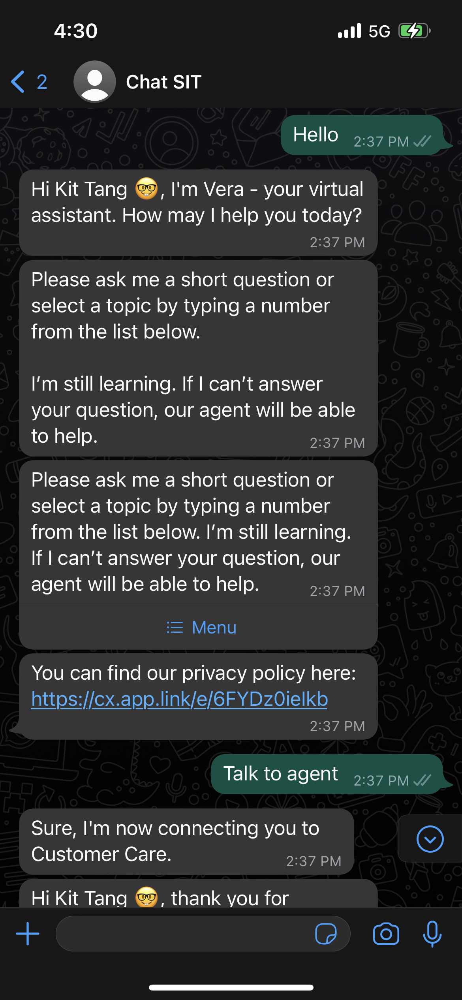
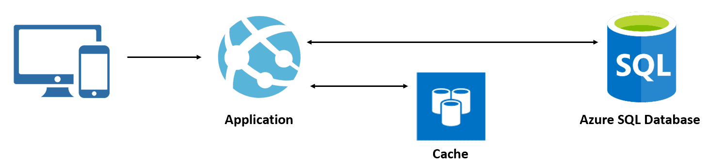

<a href="https://www.accenture.com/hk-en" target="_blank"><button>Learn more about Accenture Hong Kong</button></a>

Accenture is one of the top consulting firms doing especially well in IT consulting. I am honored to be part of the Accenture family, delivering great work to our prestigious clients. During my working period, I have worked for a local airline client to deliver an omni-channel messaging platform, integrated with its in-house chatbot solution. We were using NodeJS to consturct the backend of the project, while we also have an internal management portal developed in Angular, where we visualize chat statistics to our users. 

<h2>From Bot to Agent chats</h2>

The purpose of a chatbot is often to help mitigate the workload of CS officers. Therefore, the flow from chatbot to CS agents should be smooth and intuitive. For some of the channels with chatbot enabled, such as WhatsApp, we even made use of interactive elements such as list templates to smoothen the chat experience. 

<a href="https://wa.me/85227472747" target="_blank"><button>Try chatting with Cathay Pacific on Whatsapp!</button></a>

<h2>Azure-Redis to handle thousands of conversations</h2>

To maintain low latency in data lookup, Redis is definitely a good solution to go. We use Redis for saving conversation data, as well as template messages. 

