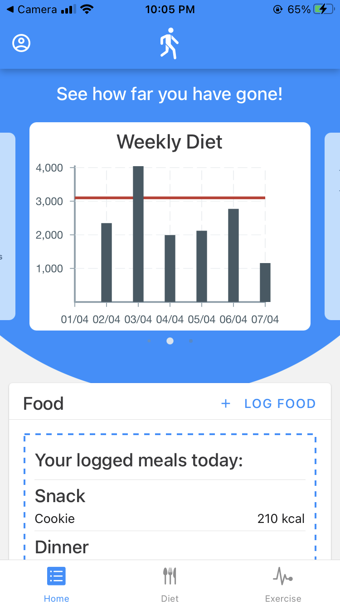
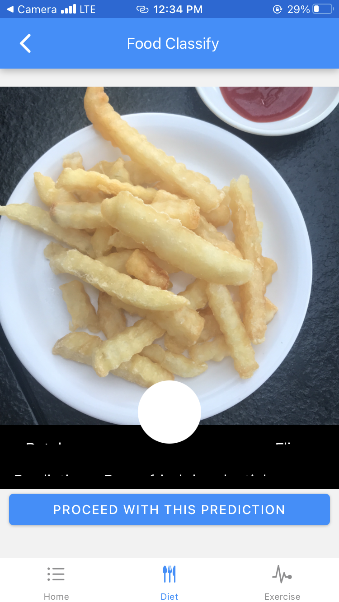
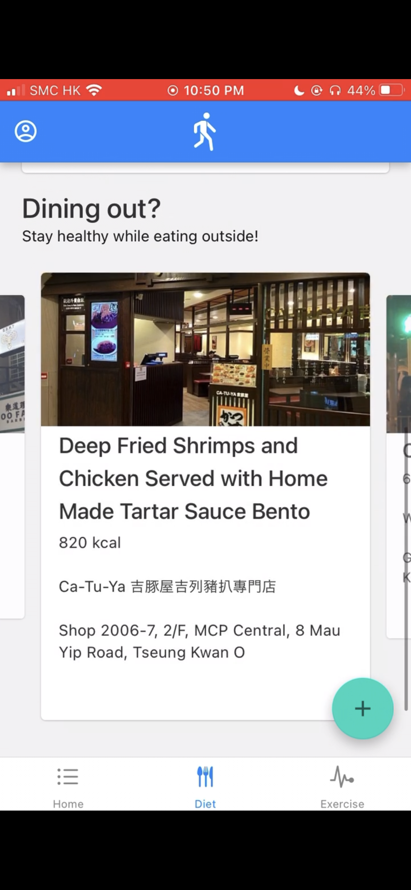

With a team of developers using different mobile OS, when we were asked to develop a mobile app, we immediately picked React Native as our core language, together with Expo as the package manager. Thanks to my MERN background, cultivated by ReUbird, I picked up React Native quickly and made significant contributions to the frontend. As for database, we are using Firebase by Google.

The 3 objectives of building this app - to record users' habits with the least effort, provide smart recommendations, and provide real time feedback for users when they exercise,

<h2>Progress Tracker</h2>

We made use of built-in sensors to get your step count, together with the activity logs user provided us, to track users' diet progress. 

<h2>Machine Learning Technologies</h2>

Meanwhile, we also want to minimize users' effort when logging their diet and workout data. This can be achieved by implementing food recognition, that can smartly detech what users are eating, and calculate the amount of calories quickly. The pose recognition feature not only helps improve users' gestures, but also log the calories burnt during their workouts.

<h2>Personalized Recommendations</h2>

Our recommendations are adjusted according to your activity in the past. We are also taking a step further in making diet recommendations by analyzing menu data from local restaurants. 

