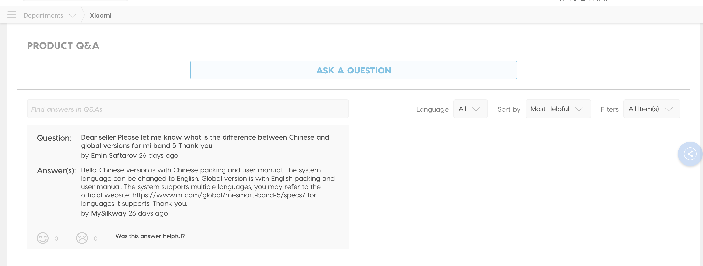
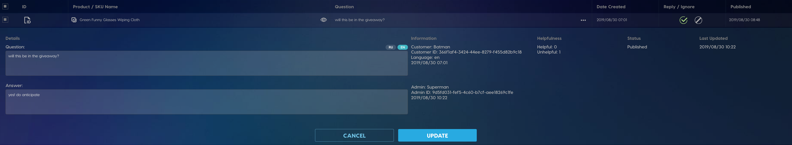

<a href="https://www.mysilkway.com/" target="_blank"><button>See Live</button></a>

This Q&A box appears on all SKU pages. Logged in customers may ask a question about the product. Customers can also view published questions and rate them.

The admin portal handles received Q&As for all SKUs. It supports functions such as publish, unpublish, reply and ignore questions.

Front End using HTML5, CSS3, JavaScript, while Back End using GoLang. We also used PostgresSQL for database and Docker for deploying the website.

