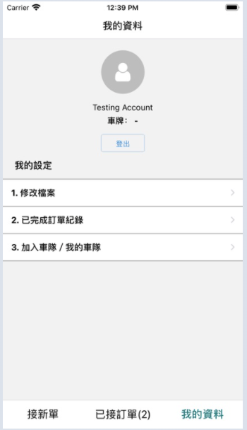
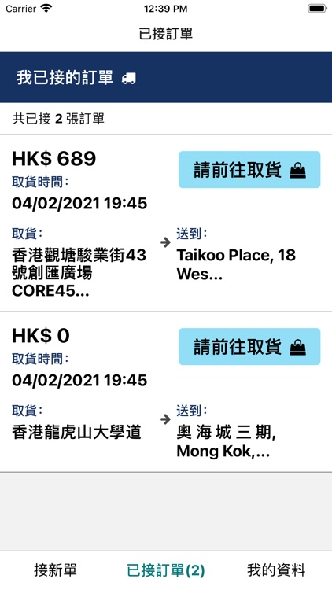
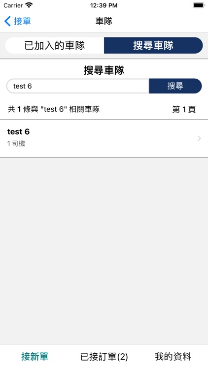

<a href="https://appadvice.com/app/rocketgo/1545319885" target="_blank"><button>App Description</button></a>

Note: Live demo is not available due to unlaunch of the product.

<h2>Cross-Platform File Management</h2>

Making use of file management systems, we allow fleet members to submit supporting documents such as car license and profile pictures. This helps improve credibitily of our drivers, and hence our platform. 

<h2>React Native Maps</h2>

It is important for drivers to locate the pickup point and destination quickly. To achieve so, we made use of the react-native-maps library, together with built-in location services to help fleet members find out the way to deliver the desired goods.
=

