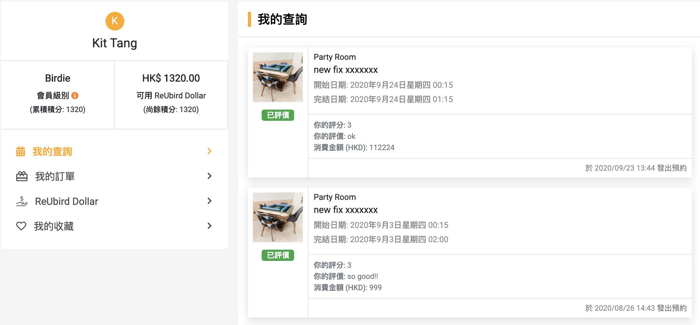

<a href="https://www.reubird.hk/" target="_blank"><button>See Live</button></a>

I have been using the MERN development stack across all portals of ReUbird. I've used ReactJS as the front end backed up by an Express server. As for database, we are using MongoDB. The portals are deployed on AWS. I will cover some of my works here.

<h2>Membership Page - Reusable Questionnaire</h2>

As a party room agency, ReUbird values the feedback from customers. Built from ReactJS, admins can design a specific questionnaire for different product categories such as party rooms, catering services, or gifts. 

