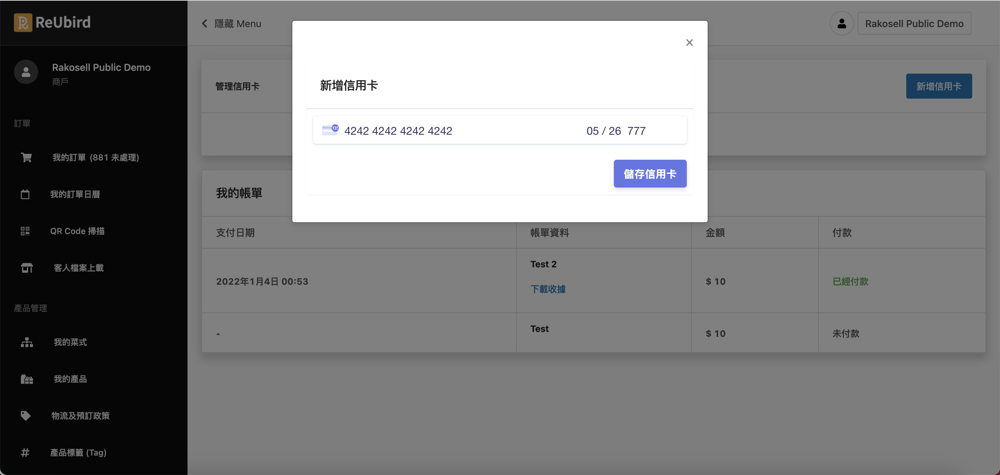

<a href="https://www.reubird.hk/" target="_blank"><button>ReUbird Official Page</button></a>

I have been using the MERN development stack across all portals of ReUbird. I've used ReactJS as the front end backed up by an Express server. As for database, we are using MongoDB. The portals are deployed on AWS. I will cover some of my works here.

<h2>Membership Page - Reusable Questionnaire</h2>

As a party room agency, ReUbird values the feedback from customers. Built from ReactJS, admins can design a specific questionnaire for different product categories such as party rooms, catering services, or gifts. 

<h2>Merchant Portal - Billing and Credit Card auto charging</h2>

One of the core features assigned to me is the smart billing for merchants, as well as credit card registration and auto charging via Stripe APIs. It is an essential feature for SaSS platforms since automation saves labor costs on handling repetitive tasks and improves accuracy. I was responsbile for both the front end and back end development of this module, well, so as many other features.

<h2>Mircoservice - PDF Generator</h2>

I was pleased to be given the chance to try Docker and ECS from AWS. One of the microservices I worked on and would like to present is the PDF generator. We wrote a very simple backend in NodeJS with the Puppeteer library to capture the content of the given URL. We then dockerized the program and deployed it to AWS ECS. Unfortunately, as it is for internal use, all external requests are banned. Sorry :( 

<a href="https://pdf.reubird.hk/pdf?url=https://reubird.hk" target="_blank"><button>Download the PDF version of ReUbird Official Site!</button></a>

