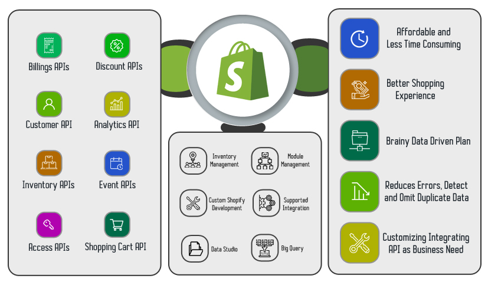
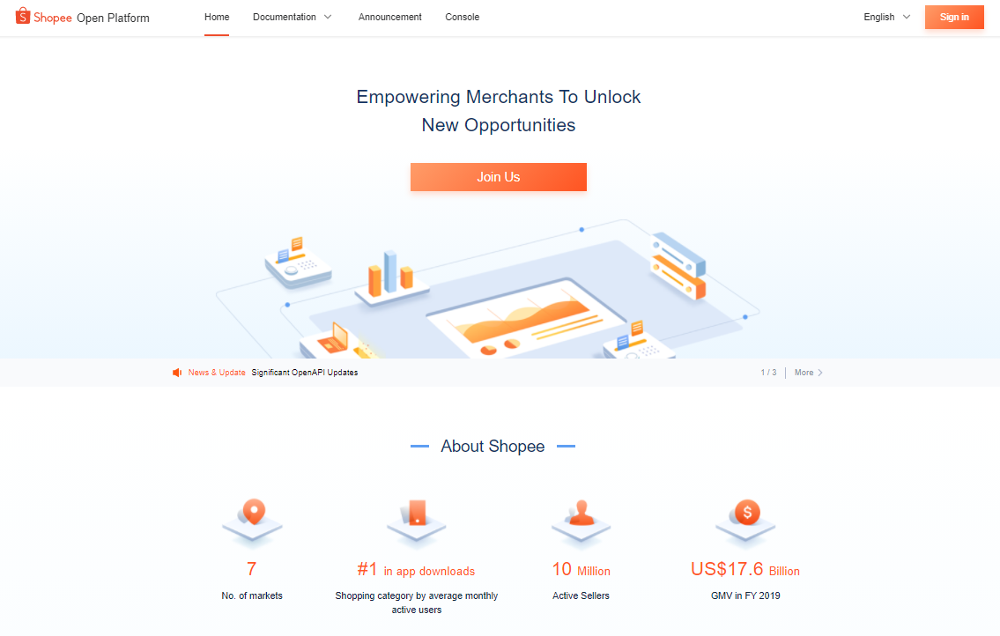

<a href="https://www.sampsonstore.com/neovision/condom/home/index.is?locale=enus" target="_blank"><button>Check out their shop (Warning: NSFW)</button></a>

Well....Every industry needs programmers! This has been one of the most enjoable part time experience I have ever had back in 2021. Not only did I gained more insights on the sexual well-being retail market, but I also got the chance to refine my Python backend skills, as well as my MySQL knowledge.

<h2>Shopify Connector</h2>

SampsonStore is also an exculsive distributor of various condom brands, including Sagami and MyOne Condoms. They have even set up their Shopify page exclusively for MyOne Condoms. During my 4-month part time, I implemented a connecotr in Python to synchronize the internal stock data with that displayed on Shopify Page.

<a href="https://www.myonecondoms.com/" target="_blank"><button>Check out their Shopify page! (Warning: NSFW)</button></a>

<h2>Shopee SG Connector</h2>

SampsonStore is also establishing its sales channel across multiple E-Commerce platforms, one of them being Shopee, which is a popular E-Commerce platform in Asia. I have also implemented a connecotr in Python to synchronize the internal stock data with that displayed on Shopee.

